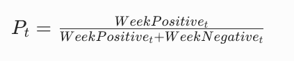
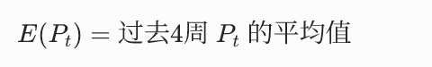
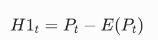
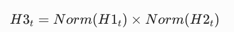

实验二 金融非结构化数据情感分析

-基于市场情绪的金融羊群效应指数构建

学时：4学时

核心定位：基于情绪指标构建羊群效应量化指标，贴合LSV模型逻辑，完成金融特征工程

**一、实验目标**

1.用周度情绪构建羊群效应指标 H1、H2、H3；

2.理解每个指标含义，掌握标准化与合成方法；

3.输出平稳、可直接用于回归的周度羊群指数。

4.支撑综合创新能力8：具备金融大数据特征工程能力，可实现跨领域量化指标设计。

**二、实验要求**

1\. 严格按照修正后的公式计算羊群效应指标，保证统计口径严谨；

2\. 对指标进行归一化处理，确保后续与股指数据对比的合理性；

3\. 按周输出完整的羊群效应指标时序数据，对接实验三建模分析。

**三、实验步骤与内容**

**1. 数据读取**

加载实验一输出的周度情绪指标数据。

**2. 羊群效应指标计算**

**2.1 参数设计思想：**

设计三个变量，

（1）H1 = 当期情绪 − 历史均值=
情绪偏离度（异常指标，对比历史）

（2）H2 = 当期内部一致性=
羊群集中度（对比今天）

（3）H3 = 偏离 × 一致=
真正羊群效应（今天不仅一边倒，还明显偏离历史常态：今天疯不是疯，对比历史也算疯，那才是真疯）

**2.2 参数实现**

变量统一说明：

WeekPositive：第 t 周正面文本条数

WeekNegative：第 t 周负面文本条数

t：第 t 周（5 个交易日为 1 周）

**（1）公式 1：周乐观情绪占比**

解释：第 t 周的乐观程度，0~1，越大越乐观。

**（2）公式2：4 周滚动平均情绪（基准）**

解释：最近 4 周的平均情绪，当作 “市场正常情绪”。

**（3）公式 3：情绪偏离度 H1t**

解释：本周情绪比平时 “高多少或低多少”。

- H1 \> 0：比平时更乐观

- H1 \< 0：比平时更悲观

**（4）公式 4：意见一致性 H2t**

$H2t = \frac{(WeekPositivet - WeekNegativet)}{WeekPositivet + WeekNegativet}$​

解释（重点）：看大家观点是否一致，有没有跟风抱团。

- H2 越小 → 大家一边倒 → 羊群效应越强

- H2 越大 → 多空分歧大 → 无羊群

**（5）公式 5：最终羊群效应指标 H3t**

解释：

Norm ( ) = 标准化，把 H1、H2 缩放到同一大小范围。

**参数设计思想总结：真正的羊群效应必须同时满足两点，**

① 情绪反常（H1 绝对值大）

② 所有人都往一个方向跟风（H2 很小）

两个条件同时满足，H3 才会变大，其余杂讯全部过滤掉。

**3. 数据预处理**

对 H1、H2 做Min-Max 归一化，剔除异常值。

**4. 结果导出**

生成包含交易日、H1t、H2t、H3t的数据集，输出：weekly_herd_index.csv

**四、实验报告**

1\. 完成系统开发，提交AI代码审核表，撰写标准的实验报告。

2\. 截取系统主要程序，界面，附加解释和运行结果图。

3\. 截取羊群效应指标时序表截图；

4\. 说明指标构建的金融逻辑与合理性

5\. 在报告上附上你所写的代码。

