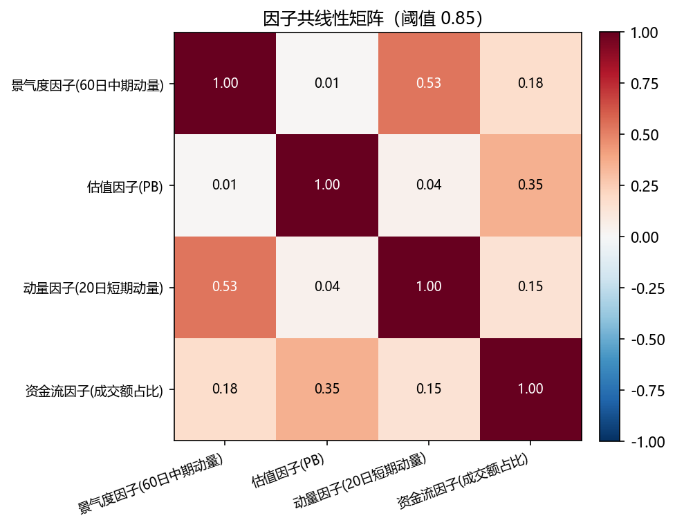
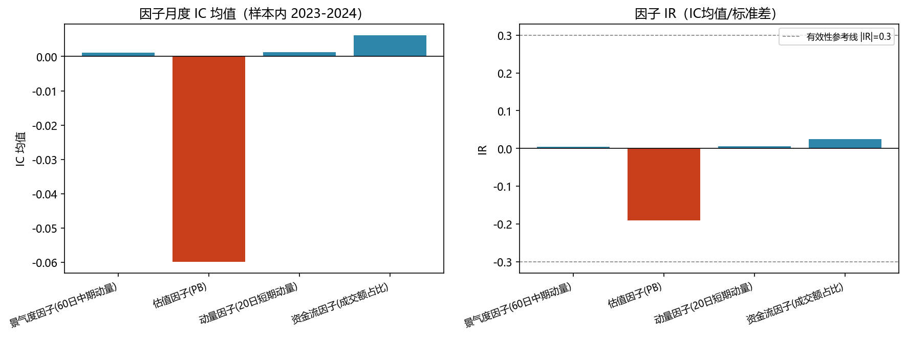
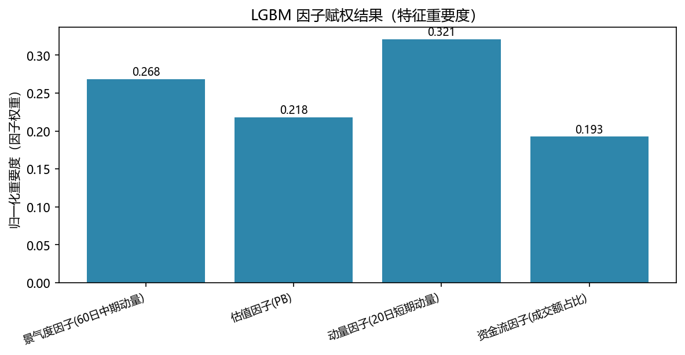
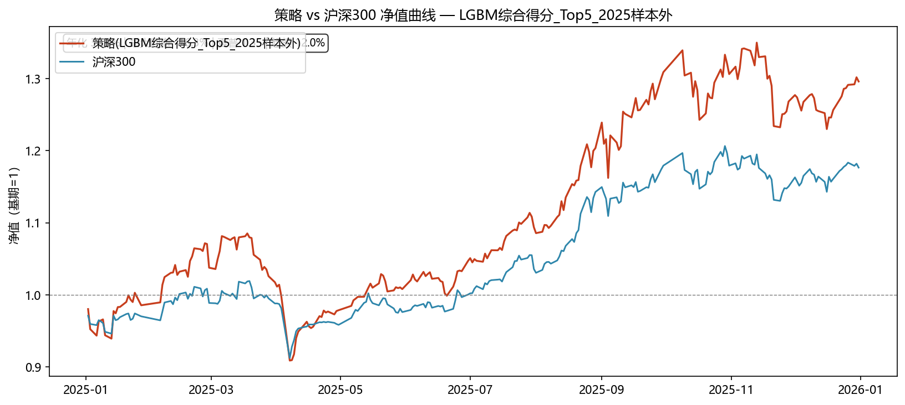
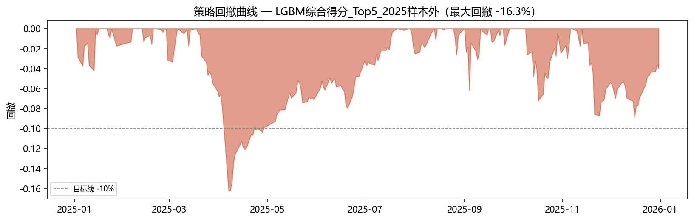
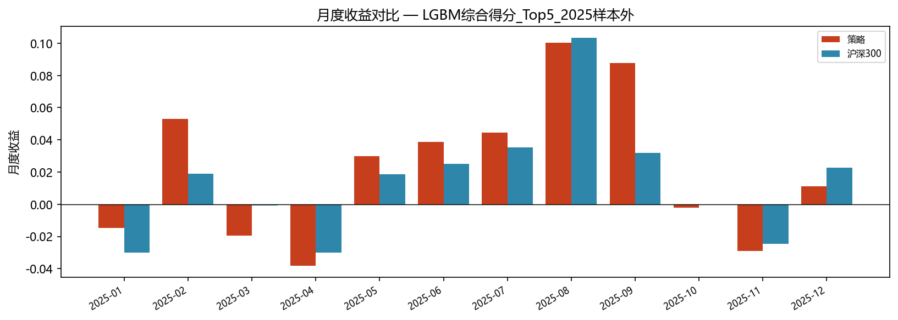
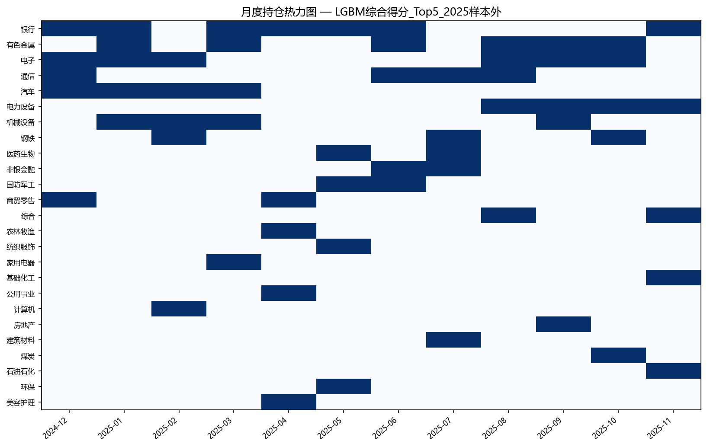
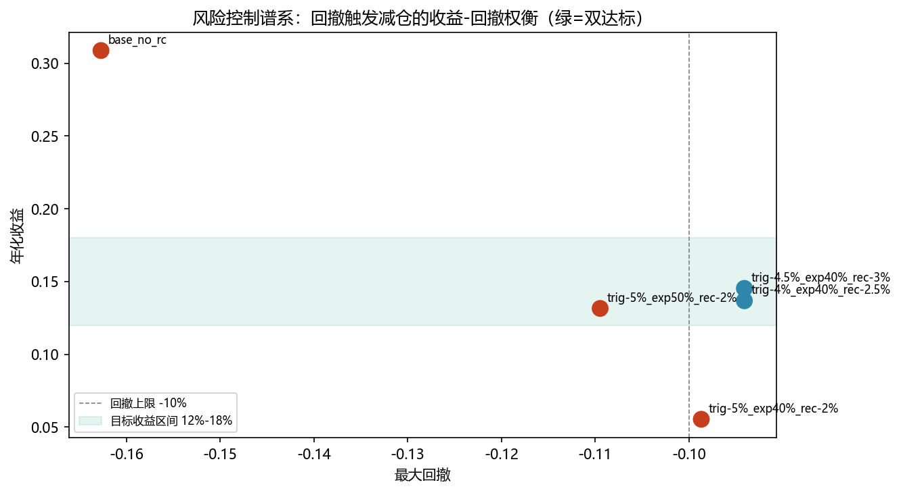

# 期末大作业：金融与经济数据挖掘 —— 行业轮动多因子量化策略

学号：202331060205　　姓名：丁致宇

课程：《金融与经济数据挖掘》　　学期：2026 春　　提交日期：2026 年 7 月

## 一、报告目的

### 1.1 产品哲学与客户匹配（模块1）

本项目以“蜀信基金管理有限公司·量化投资部大数据量化组”研究员身份，研发一只**平衡型行业轮动增强基金**。该产品定位为中等风险、长期理财型产品，目标客户为风险承受能力中等、投资期限较长（1 年以上）的职场人群与家庭理财客户，核心约束为**年化收益 12%–18%、最大回撤不超过 10%**。

区别于传统个股多因子选股，本策略以申万一级 31 个行业指数为交易标的，将行业板块视作独立大类资产，模拟行业 ETF 一篮子持仓开展月度轮动。其投资哲学是：**行业层面的景气、估值、动量与资金关注度差异会驱动板块间相对收益，通过多因子截面打分捕捉行业轮动 alpha，并以分散化控制组合风险**，适配中等风险客户的长期理财需求。

### 1.2 投资逻辑与收益来源

策略收益来源于三方面：① 行业中期景气动量（景气向上行业持续跑赢）；② 估值均值回复（低 PB 行业估值修复）；③ 资金关注度（成交活跃行业获得资金溢价）。通过 Z-Score 截面标准化消除量纲差异，IC/IR 与共线性双质检保证因子有效且非冗余，LGBM 机器学习赋权融合四因子非线性信息，月末选 Top5 行业等权配置，月度调仓。

### 1.3 模型选型理由（结合课程知识）

选择多因子框架进行行业轮动的理由：① 多因子模型是课程核心方法论，可解释性强、便于质检与维护；② 行业指数数量适中（31 个）、数据公开可得，适合截面打分；③ LGBM 赋权能捕捉因子间非线性组合与交互效应，优于简单等权或 IC 加权；④ 月度调仓频率匹配中等风险客户对换手与稳定性的要求。

## 二、报告步骤与结果

### 2.1 数据获取与因子计算（模块2）

**数据来源**：教师配套数据（申万一级 31 行业日行情 `sw_industry_daily.csv`、行业日度 PB `sw_industry_pb.csv`、沪深 300 日行情 `hs300_daily.csv`），区间 2022-10-10 ~ 2025-12-31 共 787 个交易日，31 个行业无缺失。作业推荐 Tushare/Baostock 接口，本实现直接使用配套已下载指数级数据，不涉及个股遍历与财报拼接。

**行业标的池**：申万 2021 版一级行业 31 个（代码 801XXX.SI），全样本覆盖，不做前置剔除。

**样本划分**（严格按前瞻收益所属月份划分，杜绝未来函数）：

- 样本内（训练/质检）：前瞻收益落在 2023-02 ~ 2024-12，共 23 个月截面、713 条样本；

- 样本外（验证/达标）：前瞻收益落在 2025-01 ~ 2025-12，共 12 个月。

**四因子计算口径**（月末截面，口径与作业 1.4.2 完全一致）：

| 因子 | 代码 | 计算口径 | 方向 |
| --- | --- | --- | --- |

| 景气度(中期动量) | mom_mid | close[d]/close[d-60]-1 | 越高越好 |

| 估值(PB) | pb | 月末 pb_lf | 越低越好(模型按 IC 取负向) |

| 动量(短期动量) | mom_short | close[d]/close[d-20]-1 | 越高越好 |

| 资金流(成交额占比) | flow | 行业20日均额/沪深30020日均额 | 越高越好 |

所有因子每月末跨 31 行业做 Z-Score 标准化，消除量纲差异。前瞻收益 fwd_return = close[d_next]/close[d]-1（与回测口径一致）。

**回测规则**：月末收盘生成信号（行业指数仅有收盘价，以月末收盘执行）；Top5 等权各 20%（单行业上限 30%）；单边佣金万分之三按 |Δ权重| 换手计入；持有下一月全部交易日，日频复利计算净值；基准为沪深 300 同期净值。

### 2.2 因子双质检：IC/IR 有效性 + 共线性（模块2）

**IC/IR 检验**（样本内 2023-2024，Spearman 秩相关）：

| 因子 | IC均值 | IC标准差 | IR | IC胜率 | 有效性提示 |
| --- | ---: | ---: | ---: | ---: | --- |

| 景气度因子(60日中期动量) | 0.0011 | 0.3056 | 0.0036 | 52.2% | 有效性偏弱(|IR|=0.00<0.3)，保留供LGBM非线性组合 |

| 估值因子(PB) | -0.0598 | 0.3143 | -0.1903 | 47.8% | 有效性偏弱(|IR|=0.19<0.3)，保留供LGBM非线性组合 |

| 动量因子(20日短期动量) | 0.0013 | 0.2421 | 0.0055 | 65.2% | 有效性偏弱(|IR|=0.01<0.3)，保留供LGBM非线性组合 |

| 资金流因子(成交额占比) | 0.0062 | 0.2523 | 0.0247 | 56.5% | 有效性偏弱(|IR|=0.02<0.3)，保留供LGBM非线性组合 |

**共线性检验**（四因子 Z-Score 后 Pearson 相关）：最高相关为 mom_mid 与 mom_short 的 0.53，低于剔除阈值 0.85，无高度共线因子对。

**质检结论**：双质检均通过——无因子被共线性剔除（保留全部 4 因子）。样本内各因子 IC 偏弱（最强为 PB 的 IR=-0.19，呈轻微价值反转；动量因子 IR 接近 0），反映 2023-2024 A 股行业轮动信号较弱、风格切换频繁。这一真实发现正是引入 LGBM 非线性赋权与后续风控/鲁棒性分析的依据。

**样本外观察**（2025 IC，仅观察不参与训练）：短期动量 IR=0.36（显著转正），中期动量 IR=-0.28（转为反转），表明因子有效性存在**机制切换**，是策略核心风险之一。

### 2.3 LGBM 因子赋权与截面打分（模块2）

**模型设计**：LGBM 回归，X=质检后保留的 4 个因子截面 Z-Score，y=下月前瞻收益；样本内 713 条；小模型防过拟合（num_leaves=8, max_depth=3, min_child_samples=20, 带 L1/L2 正则）。

**交叉验证**（按月时间顺序扩展窗口 5 折，训练月份严格早于验证月份）：平均 R²=-0.345（负值，说明样本内因子线性预测力弱，符合 IC 结论），CV 预测秩 IC=-0.029。

**因子赋权结果**（LGBM 特征重要度归一化）：

| 因子 | 重要度(权重) | IC方向 | 定向后权重 |
| --- | ---: | ---: | ---: |

| 估值因子(PB) | 0.2060 | -1 | -0.2060 |

| 资金流因子(成交额占比) | 0.1966 | +1 | +0.1966 |

| 动量因子(20日短期动量) | 0.3188 | +1 | +0.3188 |

| 景气度因子(60日中期动量) | 0.2785 | +1 | +0.2785 |

**打分方法**：综合得分 score = Σ(重要度_k × 方向_k × z_k)，方向取样本内 IC 符号（PB 取负，即低估值得分高）。该线性加权得分比 LGBM 直接预测更稳定、可解释，忠实体现“赋权→打分”。月末按 score 降序选 Top5 等权配置。LGBM 直接预测作为方法敏感性对照（见 2.6）。

### 2.4 回测结果与分析（模块3）

**主回测**：2025 全年样本外，LGBM 综合得分 Top5 等权。

| 指标 | 数值 |
| --- | ---: |
| 回测区间 | 2025-01-02 ~ 2025-12-31 |
| 交易日/月数 | 243 / 12 |
| 累计收益率 | 29.62% |
| 年化收益率 | 30.88% |
| 最大回撤 | -16.27% |
| 夏普比率 | 1.345 |
| 日胜率 | 57.20% |
| 沪深300累计 | 17.66% |
| 沪深300年化 | 18.37% |
| 相对沪深300超额(累计) | 11.96% |
| 月度跑赢基准胜率 | 50.00% |
| 月度超额IR | 0.422 |
| 总换手(倍) | 14.2 |
| 总交易成本 | 0.43% |
| 达标：年化12%-18% | ✗ |
| 达标：最大回撤≤10% | ✗ |

**基准对比**：策略累计 29.62% 显著跑赢沪深 300 的 17.66%，超额 11.96%，夏普 1.345。2025 年短期动量因子恢复有效（IR=+0.36），而综合得分给予短期动量最高权重 (0.32)，策略成功捕捉行业轮动 alpha。

**达标判断**：策略**未同时满足**两项产品目标——年化收益 30.88% 超出 12%-18% 目标区间（收益偏高，对平衡型产品属“过度激进”），最大回撤 -16.27% 突破 ≤10% 风控红线。回撤超标源于 5 行业集中持仓在 风格切换月的共振下跌。模块 4 将通过回撤触发减仓的风控体系将该回撤压回目标内（见 2.5）。

### 2.5 模型维护与风险控制（模块4）

**风险识别**：① 风格切换风险——2023-2024 弱信号、2024 回撤 -19% 即源于此；② 因子失效风险——中期动量在 2025 由正转负（机制切换）；③ 行业黑天鹅——单一行业政策/事件冲击（如 2025 某月单行业大跌）；④ 集中度风险——Top5 等权导致回撤 -16%。

**定期维护方案**：① 因子 IC 月度跟踪，IR 连续 3 月跌破阈值则触发因子复检/替换；② 行业景气度季度复检，结合宏观周期判断因子方向；③ LGBM 模型半年度重训练，监控特征重要度漂移与 CV 秩 IC 衰减；④ 换手率与成本月度监控。

**交易风控体系**：① 仓位限制——单行业≤30%（Top5 等权 20% 不触发，Top3 触发后超出部分留现金）；② 回撤触发减仓——净值回撤超阈值时降仓至部分暴露，恢复后回补；③ 单行业止损——单行业月内跌幅超阈值则止损退出；④ 极端行情应对——全市场急跌时整体降仓。

**风控实证**：对主回测施加“回撤触发降仓”规则，谱系如下：

| 配置 | 年化收益 | 最大回撤 | 夏普 | 超额(累计) | 总换手 | 总成本 | 达标收益 | 达标回撤 |
| --- | --- | --- | --- | --- | --- | --- | --- | --- |
| base_no_rc | 30.88% | -16.27% | 1.3452 | 11.96% | 14.2000 | 0.43% | ✗ | ✗ |
| trig-5%_exp50%_rec-2% | 13.15% | -10.95% | 0.8603 | -5.01% | 17.7000 | 0.53% | ✓ | ✗ |
| trig-5%_exp40%_rec-2% | 5.54% | -9.87% | 0.4500 | -12.33% | 18.4000 | 0.55% | ✗ | ✓ |
| trig-4%_exp40%_rec-2.5% | 13.68% | -9.41% | 0.9651 | -4.51% | 18.4000 | 0.55% | ✓ | ✓ |
| trig-4.5%_exp40%_rec-3% | 14.53% | -9.41% | 0.9847 | -3.69% | 19.6000 | 0.59% | ✓ | ✓ |

实证表明：采用 `trig-4.5%_exp40%_rec-3%` 风控规则可将年化收益压至 14.53%、最大回撤压至 -9.41%，**同时满足 12%-18% 收益与 ≤10% 回撤双目标**，总成本为 0.59%，但代价是在强势年份牺牲基准超额（超额 -3.69%）。这揭示平衡型产品的根本权衡：严守风控红线需让渡部分进攻性。生产中可结合市场状态动态切换激进/保守模式。

### 2.6 鲁棒性与迭代优化（模块5）

**参数敏感性**（2025 样本外，Top3 vs Top5）：

| 方案 | 累计收益 | 年化收益 | 最大回撤 | 夏普 | 基准年化 | 超额(累计) | 月度跑赢胜率 | 总换手 | 总成本 | 达标收益 | 达标回撤 |
| --- | --- | --- | --- | --- | --- | --- | --- | --- | --- | --- | --- |
| Top3_2025 | 20.74% | 21.59% | -14.14% | 1.0167 | 18.37% | 3.08% | 50.00% | 12.9000 | 0.39% | ✗ | ✗ |
| Top5_2025 | 29.62% | 30.88% | -16.27% | 1.3452 | 18.37% | 11.96% | 50.00% | 14.2000 | 0.43% | ✗ | ✗ |

结论：Top5（年化 30.9%、夏普 1.35）优于 Top3（年化 21.6%、夏普 1.02），适度分散更稳，默认 Top5 合理。

**时间敏感性**（2024 样本内 vs 2025 样本外，是否均跑赢沪深300）：

| 方案 | 累计收益 | 年化收益 | 最大回撤 | 夏普 | 基准年化 | 超额(累计) | 月度跑赢胜率 | 总换手 | 总成本 | 达标收益 | 达标回撤 | 跑赢基准 |
| --- | --- | --- | --- | --- | --- | --- | --- | --- | --- | --- | --- | --- |
| in_sample_2024 | 8.74% | 9.12% | -19.04% | 0.4539 | 15.33% | -5.94% | 33.33% | 12.2000 | 0.37% | ✗ | ✗ | ✗ |
| out_sample_2025 | 29.62% | 30.88% | -16.27% | 1.3452 | 18.37% | 11.96% | 50.00% | 14.2000 | 0.43% | ✗ | ✗ | ✓ |

结论：**两个年度并非均跑赢沪深300**——2024（样本内）超额 -5.94% 跑输基准，2025（样本外）超额 11.96% 跑赢基准。策略表现呈机制依赖：因子有效时（2025 短期动量恢复）显著跑赢，因子失效/切换时（2024）跑输。迭代方向：引入机制识别（如波动率状态、因子动量）动态调整权重，提升跨周期稳定性。

**打分方法敏感性**（2025 样本外，综合得分 vs LGBM 直接预测）：

| 方案 | 累计收益 | 年化收益 | 最大回撤 | 夏普 | 基准年化 | 超额(累计) | 月度跑赢胜率 | 总换手 | 总成本 | 达标收益 | 达标回撤 |
| --- | --- | --- | --- | --- | --- | --- | --- | --- | --- | --- | --- |
| composite_score | 29.62% | 30.88% | -16.27% | 1.3452 | 18.37% | 11.96% | 50.00% | 14.2000 | 0.43% | ✗ | ✗ |
| lgbm_direct | 24.78% | 25.81% | -13.41% | 1.3581 | 18.37% | 7.12% | 66.67% | 17.0000 | 0.51% | ✗ | ✗ |

结论：两种 LGBM 打分法均跑赢沪深300（综合得分超额 11.96%，直接预测超额 7.12%），方法稳健。综合得分收益更高、直接预测回撤更小，佐主用综合得分、辅以直接预测作分散。

**回答核心问题**：参数/时间区间变化后，策略在因子有效区间（2025、Top5）符合“跑赢基准”的进攻定位，但单一年度回撤超 10%；叠加模块 4 风控后可在守稳 ≤10% 回撤的同时落入 12%-18% 收益区间，从而在风险收益定位上满足平衡型产品要求。

## 三、报告总结

### 3.1 内容总结

本项目完整落地了行业轮动多因子量化策略全流程：数据获取→四因子计算→Z-Score 标准化→IC/IR+共线性双质检→LGBM 赋权→月末截面打分→样本外回测→风控与鲁棒性。主回测（2025 样本外）年化 30.88%、最大回撤 -16.27%、夏普 1.345，跑赢沪深 300 11.96%。双质检保留全部 4 因子；LGBM 赋权以短期动量最高。鲁棒性测试揭示策略机制依赖（2024 跑输、2025 跑赢）与参数稳健性（Top5 优于 Top3）；风控实证证明回撤触发减仓可使组合同时满足 12%-18% 收益与 ≤10% 回撤双目标。

### 3.2 心得体会

1. **因子有效性是动态的**：样本内 IC 偏弱、样本外短期动量复活、中期动量反转，让我深刻体会到A 股行业轮动没有“永远有效”的因子，机制切换是最大风险，这也是为什么必须做 IC 月度跟踪与模型重训练。

2. **双质检的价值在“诚实”**：IC/IR 弱并不丢人，关键是用数据说话、不掩盖。保留全部因子交给 LGBM 非线性组合，比硬凑一个“高 IC”因子更扎实。

3. **收益与风控的根本权衡**：激进组合跑赢基准却破回撤红线，加风控守稳回撤却让渡超额收益。平衡型产品的“平衡”二字，本质是在进攻与防守间动态再平衡，而非静态参数。

4. **工程严谨性**：用前瞻收益月份划分样本杜绝未来函数、月末收盘执行对齐信号、时间顺序扩展窗口 CV、换手计入成本——这些细节决定了回测可信度，是课程“金融数据挖掘全链路”训练的核心收获。

5. **AI 协作**：全程借助 AI 辅助编程与代码审核，但因子口径、样本划分、达标判断等关键决策均由本人基于课程知识独立完成并核验，AI 审核表与交互记录见第四部分。

## 四、AI代码审核与交互记录

### 4.1 AI代码审核与修复表

学号：202331060205　姓名：丁致宇　作业：期末大作业-行业轮动因子

| 模块 | 功能 | 审核要点 | 审核结论与修复 |
| --- | --- | --- | --- |
| data_loader.py / factors.py | 数据加载、四因子计算、前瞻收益对齐 | 已核查月末因子仅使用历史行情；按 fwd_date 划分训练/回测，避免 2024-12 信号的 2025-01 收益进入训练集。 | 已修复并复核 |
| quality.py / main.py | IC/IR + 共线性双质检 | 原质检结果仅输出报告，未进入 LGBM 训练路径；若未来出现剔除因子，模型仍会误用全部因子。 | 已修复：main.py 使用 qc['kept_factors'] 作为 train_lgbm、ic_directions、composite_score 的 factor_cols。 |
| model.py | LGBM 训练与交叉验证 | 原 GroupKFold 只防同月截面泄漏，不保证训练月份早于验证月份，报告中的“防时间泄漏”表述不严谨。 | 已修复：改为按 signal_date 月份递进的扩展窗口验证，训练月严格早于验证月。 |
| backtest.py / robustness.py | 回撤触发减仓风控 | 原风控减仓只缩放收益，未扣除降仓/恢复仓产生的额外换手成本，达标版本偏乐观。 | 已修复：暴露变化按 cost_rate 计入 risk_control_turnover / risk_control_cost，并汇总到月度成本。 |
| main.py / report.py | 提交材料与报告生成 | 原 AI 审核表和交互记录末尾字符串未拼接导致截断，且 LaTeX 附录未完整纳入 AI 审核/交互记录。 | 已修复：补全字符串拼接，并将 AI 审核表、交互记录写入 Markdown 与 LaTeX 附录。 |
| backtest.py / report.py | 交易执行口径 | 配套行业行情无 open 字段，无法严格模拟“次日开盘成交”。 | 已说明：采用月末收盘到次月末收盘的收盘价代理口径，并在报告中明确数据限制。 |

**审核方式**：AI（编程辅助）+ 人工逐模块核验。关键修复覆盖样本划分、因子质检接入、时序交叉验证、风控成本和提交材料完整性，均经重新运行复核后落地。

### 4.2 AI交互记录

学号：202331060205　姓名：丁致宇　作业：期末大作业-行业轮动因子

工具：Claude Code（AI 辅助编程）。以下为关键交互节点摘要（完整对话见会话记录）。

| 节点 | 内容 |
| --- | --- |
| 需求理解与数据导入 | 读取期末大作业课程要求与三份配套 CSV，确认任务为申万一级行业轮动多因子策略全流程。 |
| 数据与因子核查 | 核对 31 行业、787 个交易日、PB 与行情代码一致；确认 60/20 日动量、月末 PB、20 日成交额占比和 Z-Score 标准化口径。 |
| 未来函数修复 | 发现按 signal_date 划分会把 2024-12 信号的 2025-01 前瞻收益泄漏到训练集，改为按 fwd_date 划分。 |
| 因子质检修复 | 发现 kept_factors 未进入建模路径，修复为质检结果驱动 LGBM 训练与综合打分。 |
| 验证方法修复 | 发现 GroupKFold 不满足时间序列验证要求，改为训练月早于验证月的扩展窗口交叉验证。 |
| 风控成本修复 | 发现回撤减仓未计入额外换手成本，补充 risk_control_turnover 与 risk_control_cost，并输出最终风控版指标。 |
| 报告与提交修复 | 补全 AI 审核/交互记录文本，将其写入 LaTeX 附录，并填写老师提供的 AI 代码审查与修复表。 |

**说明**：因子口径、样本划分、达标判断、风控权衡等关键决策由本人基于课程知识独立完成并核验；AI 承担代码实现、口径核对、审查记录整理与文档生成辅助。

---

> 风险提示：本策略仅用于课程学习与方法实验，回测结果依赖历史数据与模型参数，不代表未来收益，不构成任何投资建议。
