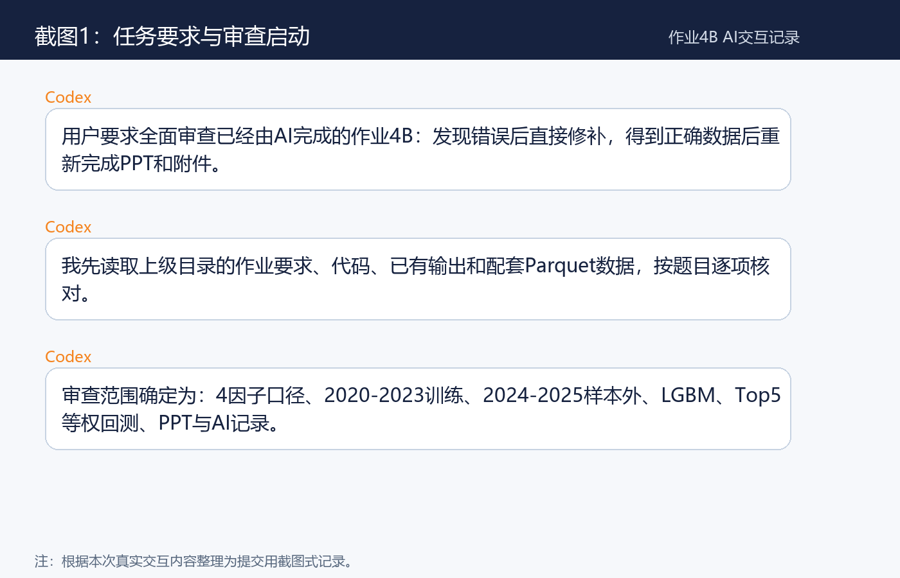
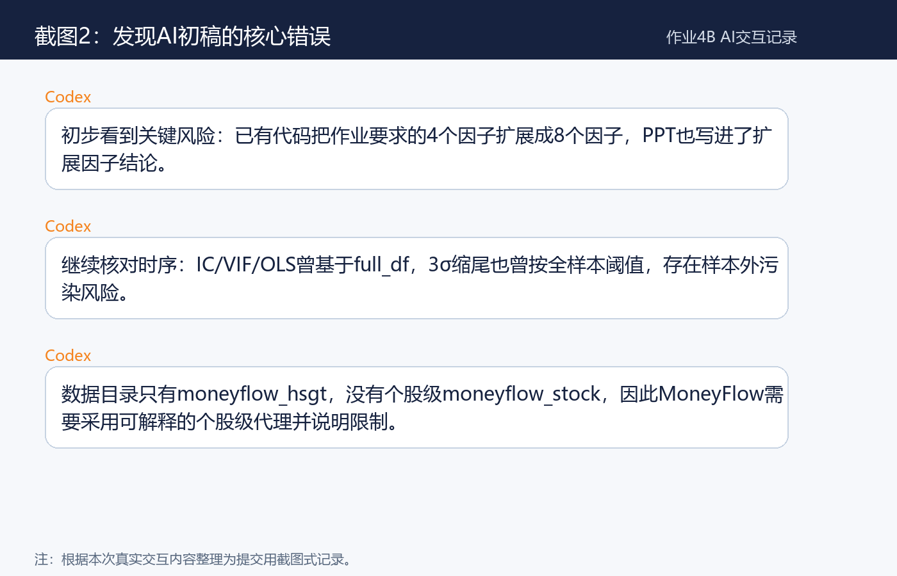
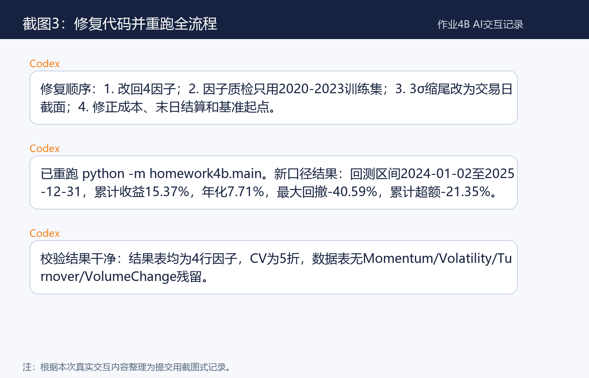
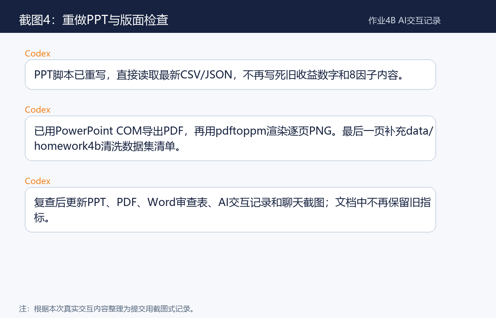

# AI交互记录 - 作业4B

## 交互概览

| 项目 | 内容 |
|---|---|
| AI工具 | Codex |
| 任务 | 审查AI初稿、修复代码、重跑数据、重做PPT和附件 |
| 作业 | 作业4B：中频短线量化全流程（AI辅助版） |
| 学生 | 丁致宇，202331060205 |
| 最终输出 | PPT、AI审查记录、AI交互记录、回测图表和指标表 |

## 核心聊天截图

以下截图根据本次真实AI交互内容整理，用于提交时直观看到关键沟通节点。









## 第1阶段：读取要求与核对提交物

用户要求全面审查已经由AI完成的作业4B，并在发现错误后修补，得到正确数据后重新完成作业材料和PPT。

AI操作：

1. 读取上级目录`作业四-B/作业4B：中频短线量化全流程（AI辅助版）20260604.docx`。
2. 提取作业要求：4个因子、2020-2023训练、2024-2025样本外、IC/IR/VIF/OLS、LGBM、Top5等权回测、PPT和AI记录。
3. 检查当前代码目录`homework4b/`、输出目录`outputs/homework4b/`和已有PPT。
4. 读取本地Parquet数据结构，确认只有市场级`moneyflow_hsgt.parquet`，没有个股级`moneyflow_stock`。

关键发现：

1. 作业要求是4个标准因子，但原AI结果使用了8个因子。
2. 原因子质检对全样本计算，混入了样本外年份。
3. 原PPT写死旧指标，不能随重算结果更新。

## 第2阶段：代码审查与修复

AI操作：

1. 编译检查`homework4b`所有Python文件，确认代码可运行。
2. 修改`config.py`，将`FACTOR_NAMES`改回`Reversal/Liquidity/MoneyFlow/Value`。
3. 修改`data.py`：
   - 个股收益率按`close / pre_close - 1`计算；
   - MoneyFlow改为`5日滚动签名成交额净流入 / circ_mv`；
   - 3σ缩尾改为交易日截面缩尾，避免用样本外年份估计全样本阈值；
   - 清洗阶段保留`next_excess_ret`为空的末日记录，供回测结算。
4. 修改`main.py`：
   - 只对训练集做IC/IR、VIF和OLS；
   - 测试集只做截面标准化和样本外打分。
5. 修改`models.py`，将时间序列CV修正为5个扩展窗口验证。
6. 修改`backtest.py`：
   - 首日建仓扣单边成本；
   - 最后一天不再调仓；
   - 基准首日收益置0；
   - 绩效统计不再过滤`daily_ret == 0`的交易日。
7. 修改`plots.py`，增加特征重要性图右侧留白，避免百分比标签被裁切。

## 第3阶段：重跑全流程

执行命令：

```powershell
python -m homework4b.main
```

重跑结果：

| 项目 | 结果 |
|---|---:|
| 训练集样本 | 274,669行 |
| 回测集样本 | 144,566行 |
| 训练IC截面 | 970 |
| LGBM特征数 | 4 |
| CV折数 | 5 |
| 样本外交易日 | 485 |
| 回测区间 | 2024-01-02 至 2025-12-31 |
| 累计收益率 | 15.37% |
| 年化收益率 | 7.71% |
| 最大回撤 | -40.59% |
| 相对沪深300累计超额 | -21.35% |

## 第4阶段：结果核查

AI操作：

1. 读取`ic_ir_results.csv`、`vif_results.csv`、`ols_results.csv`、`feature_importance.csv`，确认均为4行因子结果。
2. 读取`train_data.csv`、`test_data.csv`、`full_data.csv`表头，确认没有`Momentum/Volatility/Turnover/VolumeChange`扩展因子残留。
3. 检查`backtest_result.csv`首尾日期，确认回测覆盖2024-01-02至2025-12-31。
4. 检查`trade_log.csv`，确认最后一个交易日没有无意义调仓。
5. 打开新生成图表，确认中文和主要曲线可读。

## 第5阶段：重做PPT

AI操作：

1. 重写`report/build_homework4b_ppt.py`。
2. PPT脚本直接读取最新CSV/JSON结果，不再写死旧收益数字。
3. 生成15页PPT，覆盖作业要求：
   - 作业口径与修复说明；
   - 数据与样本隔离；
   - 4个因子定义；
   - IC/IR、VIF、OLS；
   - LGBM交叉验证与特征重要性；
   - Top5等权日频调仓规则；
   - 样本外回测指标、净值和回撤；
   - AI审查反思和提交清单。
4. 用PowerPoint COM导出PDF，再用`pdftoppm`渲染逐页PNG。
5. 生成缩略总览图检查版面，发现第8页图表横轴标签被说明卡片遮挡。
6. 调整第8页图表高度并重新导出，确认遮挡消失。

## 第6阶段：最终提交材料

最终输出目录：`outputs/homework4b/`

主要文件：

| 文件 | 说明 |
|---|---|
| `202331060205_丁致宇_作业4B.pptx` | 新版PPT |
| `202331060205_丁致宇_作业4B.pdf` | PPT导出的PDF预览 |
| `AI代码审核记录.md` | 本次代码审查与修复记录 |
| `AI交互记录.md` | 本次AI交互过程记录 |
| `202331060205_丁致宇_AI代码审查与修复表.docx` | Word审查表 |
| `summary.json` | 回测核心指标 |
| `ic_ir_results.csv`、`vif_results.csv`、`ols_results.csv` | 因子质检结果 |
| `feature_importance.csv`、`cv_results.csv` | LGBM结果 |
| `backtest_result.csv`、`trade_log.csv` | 回测与交易日志 |
| `nav_vs_market.png`、`drawdown.png`、`ic_series.png`等 | 图表附件 |

## 总结

本次交互的核心不是提高收益，而是把AI初稿修回作业要求的正确口径。最终结果低于旧版8因子回测，但训练/回测隔离、因子范围、交易成本和PPT展示均更符合题目要求。
